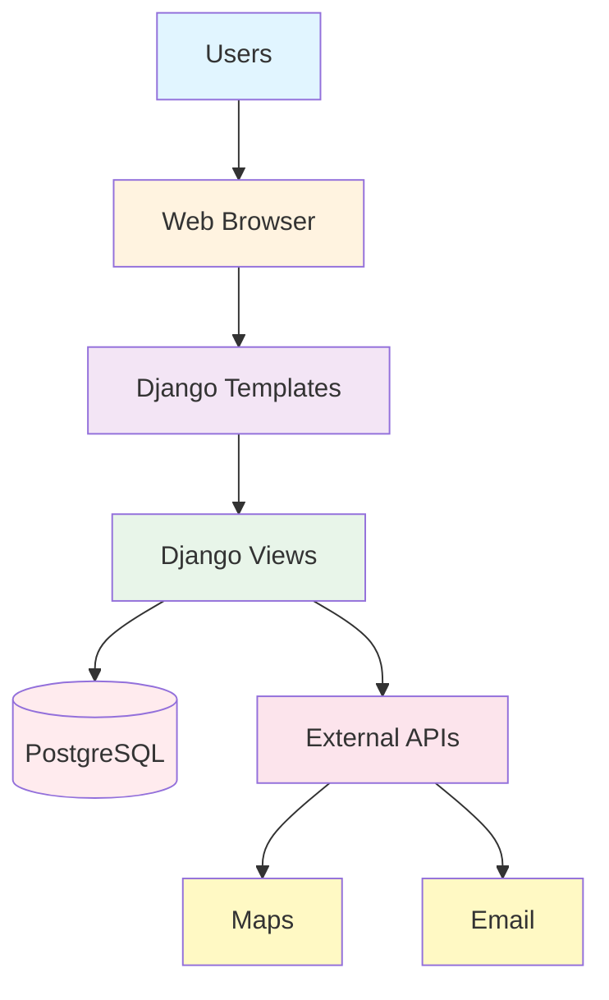

# How to Create System Architecture Diagram (JPG/PNG)

## Option 1: Using Mermaid Live Editor (Recommended)

1. **Open Mermaid Live Editor**
   - Go to: https://mermaid.live/
   - This is a free online tool to create diagrams from code

2. **Copy the Mermaid Code**
   - Open `SYSTEM_ARCHITECTURE.md`
   - Copy the code between the ```mermaid ``` tags

3. **Paste in Mermaid Editor**
   - Paste the code into the left panel of mermaid.live
   - The diagram will automatically render on the right

4. **Export as PNG/JPG**
   - Click the "Actions" button (three dots) in the top-right
   - Select "Export PNG" or "Export SVG"
   - Save the image as `system_architecture.png` or `system_architecture.jpg`

5. **Place in Project Report Folder**
   - Move the image to your project report folder
   - Add it to your PROJECT_REPORT.md

## Option 2: Using Draw.io (Alternative)

1. **Open Draw.io**
   - Go to: https://app.diagrams.net/
   - Create a new diagram

2. **Recreate the Architecture**
   - Use the ASCII diagram in SYSTEM_ARCHITECTURE.md as reference
   - Drag and drop shapes to recreate the architecture
   - Use different colors for each layer

3. **Export as JPG**
   - File → Export as → JPG
   - Save as `system_architecture.jpg`

## Option 3: Using PowerPoint/Keynote

1. **Create a new slide**
2. **Add rectangles for each component**
3. **Use SmartArt or shapes**
4. **Connect with arrows**
5. **Save as JPG/PNG**

## Recommended Image Size for Report

- **Width**: 1200-1600 pixels
- **Height**: 800-1000 pixels
- **Format**: PNG (better quality) or JPG (smaller file size)
- **DPI**: 150-300 DPI for print

## Adding to Project Report

Add this section to your PROJECT_REPORT.md:

```markdown
## System Architecture


The blood donation platform follows a layered architecture pattern:

1. **Client Layer**: Web and mobile browsers for user access
2. **Frontend Layer**: Django templates with Bootstrap 5 for responsive UI
3. **API Layer**: RESTful APIs for data exchange
4. **Business Logic Layer**: Django views implementing core functionality
5. **Data Layer**: PostgreSQL database for persistent storage
6. **External Services**: Maps, geocoding, and email services

This architecture ensures scalability, maintainability, and separation of concerns.
```

## Quick Mermaid Code for Simple Architecture

If you want a simpler diagram, use this code:



## Color Scheme Reference

- **Client Layer**: Blue (#e1f5ff)
- **Frontend Layer**: Orange (#fff3e0)
- **API Layer**: Purple (#f3e5f5)
- **Business Logic**: Green (#e8f5e9)
- **Database**: Red (#ffebee)
- **External Services**: Pink (#fce4ec)
- **Authentication**: Yellow (#fff9c4)
- **Static Assets**: Teal (#e0f2f1)
