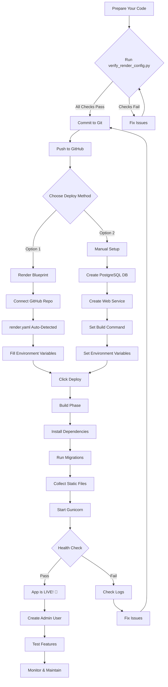

# 🎨 Render Deployment Flowchart

## Visual Guide to Deploying Your BloodLife Platform



---

## 📋 Step-by-Step Visual Process

### Phase 1: Preparation ✅
```
Your Code → Verify → Fix Issues → Commit → Push
   ↓
All checks pass? 
   ↓
YES → Proceed to deployment
NO  → Fix issues first
```

### Phase 2: Deployment on Render 🚀
```
Render Dashboard
   ↓
New + → Blueprint (Auto) OR Web Service (Manual)
   ↓
Connect GitHub Repository
   ↓
Configure Settings
   ├─ Build Command: ./render_build.sh
   ├─ Start Command: gunicorn ...
   └─ Environment Variables
   ↓
Click Deploy
```

### Phase 3: Build Process 🔨
```
Render Build Server
   ↓
1. Clone Repository
   ↓
2. Run render_build.sh
   ├─ Create directories
   ├─ Install Python packages
   ├─ Verify Django installation
   ├─ Check environment variables
   ├─ Run database migrations
   └─ Collect static files
   ↓
3. Build Complete ✅
```

### Phase 4: Runtime 🏃
```
Gunicorn Server Starts
   ↓
4 Worker Processes
   ↓
Listen on $PORT
   ↓
Serve HTTP Requests
   ├─ Static Files (WhiteNoise)
   ├─ Dynamic Pages (Django)
   └─ API Endpoints (DRF)
   ↓
PostgreSQL Database
   └─ Persistent Data Storage
```

---

## 🔄 Continuous Deployment

```
Code Changes
   ↓
git push origin main
   ↓
Render Detects Push
   ↓
Auto-Build & Deploy
   ↓
Zero Downtime Update
   ↓
New Version Live!
```

---

## 🎯 Environment Variables Flow

```
Render Dashboard → Environment Tab
   ↓
Set Variables
   ├─ DATABASE_URL (from PostgreSQL)
   ├─ SECRET_KEY (auto-generated)
   ├─ BREVO_API_KEY (from Brevo)
   └─ Others...
   ↓
Available to Django
   ↓
settings.py reads via config()
   ↓
App configured correctly
```

---

## 📊 Request Flow

```
User Browser
   ↓
HTTPS Request
   ↓
Render Load Balancer
   ↓
Your Web Service
   ↓
Gunicorn (4 workers)
   ↓
Django Application
   ├─ WhiteNoise → Static Files
   ├─ Views → HTML Pages
   └─ API → JSON Responses
   ↓
PostgreSQL (if needed)
   ↓
Response to User
```

---

## 🗂️ File Structure on Render

```
/opt/render/project/src/
├── blood_donation/          # Django settings
│   ├── settings.py
│   ├── wsgi.py
│   ├── asgi.py
│   └── urls.py
├── accounts/                # User accounts app
├── donors/                  # Donors app
├── blood_requests_app/      # Blood requests app
├── notifications/           # Notifications app
├── analytics/               # Analytics app
├── templates/               # HTML templates
├── static/                  # Static source files
├── staticfiles/             # Collected static (production)
├── media/                   # User uploads
├── manage.py
├── requirements.txt
├── Procfile
└── render_build.sh
```

---

## 🚦 Deployment Status Indicators

```
🔵 Building - Code is being compiled
🟡 Deploying - Services are starting
🟢 Live - App is running successfully
🔴 Failed - Error occurred (check logs)
⚪ Starting - Initial startup
```

---

## 🎓 Quick Reference

### Commands You'll Use

```bash
# Before deployment
python verify_render_config.py

# Git workflow
git add .
git commit -m "Description"
git push origin main

# Render shell (post-deployment)
python manage.py createsuperuser
python manage.py migrate
python manage.py collectstatic
```

### URLs to Remember

```
Homepage:     https://your-app.onrender.com/
Health Check: https://your-app.onrender.com/health/
Admin Panel:  https://your-app.onrender.com/secure-admin-panel-x92/
API:          https://your-app.onrender.com/api/v2/
Logs:         Render Dashboard → Logs tab
```

---

## 💡 Pro Tips

1. **Free Tier**: App sleeps after 15 min → Use UptimeRobot
2. **Database**: Free DB expires in 90 days → Backup regularly
3. **Logs**: Check logs first when debugging
4. **Environment**: Never commit `.env` file
5. **Migrations**: Auto-run on deploy via Procfile
6. **Static Files**: Auto-collected during build
7. **Rollback**: Previous versions available in dashboard

---

**Follow this flowchart and you'll have a smooth deployment! 🚀**
