# Blood Donation Platform - System Architecture Diagram

## Mermaid Diagram (Copy this to https://mermaid.live/ to export as PNG/JPG)

```mermaid
graph TB
    subgraph "Client Layer"
        A[Web Browser]
        B[Mobile Browser]
        C[Admin Dashboard]
    end

    subgraph "Frontend Layer - Django Templates"
        D[base.html]
        E[home.html]
        F[donor_search.html]
        G[track_request_dashboard.html]
        H[chat_widget.html]
        I[donor_profile.html]
    end

    subgraph "API Layer - Django REST Framework"
        J[Donor Search API]
        K[Live Requests API]
        L[Chat API]
        M[Notifications API]
        N[User Profile API]
        O[Blood Request API]
    end

    subgraph "Business Logic Layer - Django Views"
        P[DonorSearchView]
        Q[BloodRequestViews]
        R[ChatbotService]
        S[NotificationService]
        T[AuthenticationViews]
        U[BloodMatcher]
    end

    subgraph "Data Layer - PostgreSQL Database"
        V[(Users Table)]
        W[(DonorProfiles Table)]
        X[(BloodRequests Table)]
        Y[(RequestResponses Table)]
        Z[(Notifications Table)]
        AA[(ChatMessages Table)]
        AB[(PrivacySettings Table)]
    end

    subgraph "External Services"
        AC[Leaflet Maps API]
        AD[OpenStreetMap]
        AE[Nominatim Geocoding]
        AF[Email Service]
    end

    subgraph "Authentication & Security"
        AG[JWT Tokens]
        AH[Captcha]
        AI[Rate Limiting]
    end

    subgraph "Static Assets"
        AJ[Bootstrap CSS]
        AK[Bootstrap Icons]
        AL[Custom CSS]
        AM[JavaScript Files]
    end

    %% Client to Frontend
    A --> D
    B --> D
    C --> D

    %% Frontend to API
    D --> J
    E --> K
    G --> L
    F --> M
    I --> N

    %% API to Business Logic
    J --> P
    K --> Q
    L --> R
    M --> S
    N --> T
    O --> U

    %% Business Logic to Database
    P --> V
    P --> W
    Q --> X
    Q --> Y
    R --> AA
    S --> Z
    T --> V
    T --> AB

    %% External Services
    Q --> AC
    Q --> AD
    Q --> AE
    S --> AF

    %% Authentication
    T --> AG
    T --> AH
    T --> AI

    %% Static Assets
    D --> AJ
    D --> AK
    D --> AL
    D --> AM

    %% Styling
    classDef client fill:#e1f5ff,stroke:#01579b,stroke-width:2px
    classDef frontend fill:#fff3e0,stroke:#e65100,stroke-width:2px
    classDef api fill:#f3e5f5,stroke:#4a148c,stroke-width:2px
    classDef business fill:#e8f5e9,stroke:#1b5e20,stroke-width:2px
    classDef database fill:#ffebee,stroke:#b71c1c,stroke-width:2px
    classDef external fill:#fce4ec,stroke:#880e4f,stroke-width:2px
    classDef auth fill:#fff9c4,stroke:#f57f17,stroke-width:2px
    classDef static fill:#e0f2f1,stroke:#00695c,stroke-width:2px

    class A,B,C client
    class D,E,F,G,H,I frontend
    class J,K,L,M,N,O api
    class P,Q,R,S,T,U business
    class V,W,X,Y,Z,AA,AB database
    class AC,AD,AE,AF external
    class AG,AH,AI auth
    class AJ,AK,AL,AM static
```



## ASCII Architecture Diagram (Alternative)

```
┌─────────────────────────────────────────────────────────────────┐
│                        CLIENT LAYER                              │
├─────────────────────────────────────────────────────────────────┤
│  ┌─────────────┐  ┌─────────────┐  ┌─────────────┐             │
│  │   Web App   │  │   Mobile    │  │   Admin     │             │
│  │   Browser   │  │   Browser   │  │  Dashboard  │             │
│  └──────┬──────┘  └──────┬──────┘  └──────┬──────┘             │
└─────────┼────────────────┼────────────────┼─────────────────────┘
          │                │                │
          └────────────────┼────────────────┘
                           ▼
┌─────────────────────────────────────────────────────────────────┐
│                    FRONTEND LAYER                               │
│              (Django Templates + Bootstrap 5)                   │
├─────────────────────────────────────────────────────────────────┤
│  ┌──────────┐ ┌──────────┐ ┌──────────┐ ┌──────────┐           │
│  │ base.html│ │home.html │ │donor_    │ │track_    │           │
│  │          │ │          │ │search    │ │request   │           │
│  └──────────┘ └──────────┘ └──────────┘ └──────────┘           │
│  ┌──────────┐ ┌──────────┐ ┌──────────┐                        │
│  │chat_     │ │donor_    │ │navbar    │                        │
│  │widget    │ │profile   │ │partials  │                        │
│  └──────────┘ └──────────┘ └──────────┘                        │
└─────────────────────────────────────────────────────────────────┘
                           ▼
┌─────────────────────────────────────────────────────────────────┐
│                      API LAYER                                   │
│              (Django REST Framework)                            │
├─────────────────────────────────────────────────────────────────┤
│  ┌──────────────┐ ┌──────────────┐ ┌──────────────┐            │
│  │Donor Search  │ │Live Requests │ │Chat API      │            │
│  │API           │ │API           │ │              │            │
│  └──────┬───────┘ └──────┬───────┘ └──────┬───────┘            │
│  ┌──────────────┐ ┌──────────────┐ ┌──────────────┐            │
│  │Notifications │ │User Profile  │ │Blood Request │            │
│  │API           │ │API           │ │API           │            │
│  └──────┬───────┘ └──────┬───────┘ └──────┬───────┘            │
└─────────┼────────────────┼────────────────┼─────────────────────┘
          │                │                │
          └────────────────┼────────────────┘
                           ▼
┌─────────────────────────────────────────────────────────────────┐
│                   BUSINESS LOGIC LAYER                          │
│                      (Django Views)                             │
├─────────────────────────────────────────────────────────────────┤
│  ┌──────────────┐ ┌──────────────┐ ┌──────────────┐            │
│  │DonorSearch   │ │BloodRequest  │ │Chatbot       │            │
│  │View          │ │Views         │ │Service       │            │
│  └──────┬───────┘ └──────┬───────┘ └──────┬───────┘            │
│  ┌──────────────┐ ┌──────────────┐ ┌──────────────┐            │
│  │Notification  │ │Auth Views    │ │BloodMatcher  │            │
│  │Service       │ │              │ │              │            │
│  └──────┬───────┘ └──────┬───────┘ └──────┬───────┘            │
└─────────┼────────────────┼────────────────┼─────────────────────┘
          │                │                │
          └────────────────┼────────────────┘
                           ▼
┌─────────────────────────────────────────────────────────────────┐
│                    DATA LAYER                                    │
│                  (PostgreSQL Database)                           │
├─────────────────────────────────────────────────────────────────┤
│  ┌──────────┐ ┌──────────┐ ┌──────────┐ ┌──────────┐         │
│  │ Users    │ │Donor     │ │Blood     │ │Request   │         │
│  │ Table    │ │Profiles  │ │Requests  │ │Responses │         │
│  └──────────┘ └──────────┘ └──────────┘ └──────────┘         │
│  ┌──────────┐ ┌──────────┐ ┌──────────┐                     │
│  │Notifi-   │ │Chat      │ │Privacy   │                     │
│  │cations   │ │Messages  │ │Settings  │                     │
│  └──────────┘ └──────────┘ └──────────┘                     │
└─────────────────────────────────────────────────────────────────┘
          │                │                │
          └────────────────┼────────────────┘
                           ▼
┌─────────────────────────────────────────────────────────────────┐
│                   EXTERNAL SERVICES                              │
├─────────────────────────────────────────────────────────────────┤
│  ┌──────────────┐ ┌──────────────┐ ┌──────────────┐            │
│  │Leaflet Maps  │ │OpenStreetMap │ │Nominatim     │            │
│  │API           │ │              │ │Geocoding     │            │
│  └──────────────┘ └──────────────┘ └──────────────┘            │
│  ┌──────────────┐                                               │
│  │Email Service │                                               │
│  └──────────────┘                                               │
└─────────────────────────────────────────────────────────────────┘

┌─────────────────────────────────────────────────────────────────┐
│              AUTHENTICATION & SECURITY                           │
├─────────────────────────────────────────────────────────────────┤
│  ┌──────────┐ ┌──────────┐ ┌──────────┐                       │
│  │JWT       │ │Captcha   │ │Rate      │                       │
│  │Tokens    │ │          │ │Limiting  │                       │
│  └──────────┘ └──────────┘ └──────────┘                       │
└─────────────────────────────────────────────────────────────────┘

┌─────────────────────────────────────────────────────────────────┐
│                   STATIC ASSETS                                  │
├─────────────────────────────────────────────────────────────────┤
│  ┌──────────┐ ┌──────────┐ ┌──────────┐ ┌──────────┐         │
│  │Bootstrap │ │Bootstrap │ │Custom    │ │JavaScript│         │
│  │CSS       │ │Icons     │ │CSS       │ │Files     │         │
│  └──────────┘ └──────────┘ └──────────┘ └──────────┘         │
└─────────────────────────────────────────────────────────────────┘
```

## Component Description

### Client Layer
- **Web Browser**: Desktop users accessing the platform
- **Mobile Browser**: Mobile users with responsive design
- **Admin Dashboard**: Admin interface for managing requests and users

### Frontend Layer
- **Django Templates**: Server-side rendered HTML templates
- **Bootstrap 5**: CSS framework for responsive design
- **Bootstrap Icons**: Icon library for UI elements
- **Custom CSS**: Additional styling for specific components

### API Layer
- **Donor Search API**: Search and filter donors by blood group, location
- **Live Requests API**: Fetch active blood requests in real-time
- **Chat API**: Real-time messaging between donors and requesters
- **Notifications API**: Push notifications for important updates
- **User Profile API**: Manage user profiles and settings
- **Blood Request API**: Create, update, and track blood requests

### Business Logic Layer
- **DonorSearchView**: Handles donor search with BloodMatcher algorithm
- **BloodRequestViews**: Manages blood request lifecycle
- **ChatbotService**: AI-powered chatbot for user assistance
- **NotificationService**: Sends notifications via email and in-app
- **AuthenticationViews**: User registration, login, JWT token management
- **BloodMatcher**: Algorithm to match donors with requests

### Data Layer
- **Users**: User accounts and authentication data
- **DonorProfiles**: Extended donor information (photo, medical history)
- **BloodRequests**: Blood donation requests with status tracking
- **RequestResponses**: Donor responses to blood requests
- **Notifications**: System notifications for users
- **ChatMessages**: Real-time chat messages
- **PrivacySettings**: User privacy preferences

### External Services
- **Leaflet Maps API**: Interactive maps for location visualization
- **OpenStreetMap**: Free map tiles for rendering
- **Nominatim Geocoding**: Convert addresses to coordinates
- **Email Service**: Send notification emails

### Authentication & Security
- **JWT Tokens**: Secure token-based authentication
- **Captcha**: Form protection against bots
- **Rate Limiting**: Prevent API abuse

### Static Assets
- **Bootstrap CSS**: Responsive CSS framework
- **Bootstrap Icons**: Icon font library
- **Custom CSS**: Project-specific styling
- **JavaScript Files**: Client-side functionality

## Data Flow

1. **User Registration/Login** → JWT Token Generation → Dashboard Access
2. **Blood Request Creation** → Notification Service → Donor Matching
3. **Donor Search** → BloodMatcher → Location-based Filtering → Results
4. **Real-time Updates** → WebSocket/Polling → Live Feed Update
5. **Chat Communication** → Chat API → Message Storage → Real-time Delivery

## Technology Stack

- **Frontend**: Django Templates, Bootstrap 5, JavaScript, Leaflet.js
- **Backend**: Django, Django REST Framework, Python 3.13
- **Database**: PostgreSQL
- **Authentication**: JWT (SimpleJWT)
- **Maps**: Leaflet.js, OpenStreetMap, Nominatim
- **Deployment**: Render (PaaS)
- **Version Control**: Git, GitHub
